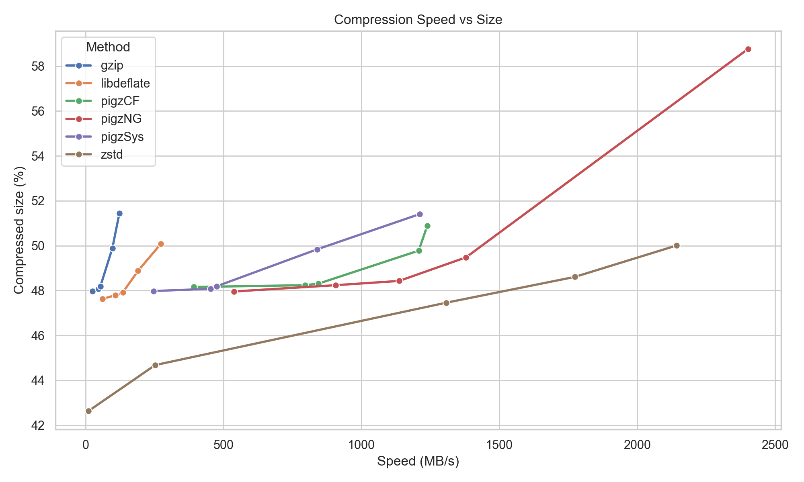

# pigz-bench

## Introduction

These simple scripts benchmark different zlib compression methods for the [gzip compression format](https://en.wikipedia.org/wiki/Gzip).Although newer algorithms like [zstd](https://en.wikipedia.org/wiki/Zstd) offer better compression ratios and faster speeds, GZip remains widely used thanks to its simplicity, portability, and long-standing integration with many tools and file formats.

Two methods can be used to enhance GZip files. First, [pigz](https://zlib.net/pigz/) uses parallel compression can use multiple cores available with modern computers to rapidly compress data. This technique can be combined with the [CloudFlare zlib](https://github.com/cloudflare/zlib) or [zlib-ng](https://github.com/zlib-ng/zlib-ng) which accelerate compression using other features of modern hardware.

Alternatively, [libdeflate](https://github.com/ebiggers/libdeflate) provides exceptional single threaded performance for the zlib format. It also provides superior file compression (with levels up to `12`). However, unlike cloudflare and zlib-ng, it does not support multiple threads, nor is the API directly compatible with zlib.

## Example Results

Here is the performance of different variations of pigz for compressing files for an Apple MacBook with an M4 Pro CPU. The graph also shows the performance of the single threaded gzip provided by Apple as well as the modern [zstd v1.5.7](https://github.com/facebook/zstd).



We can also compare decompression speed, which is generally faster than compression. However, GZip decompression cannot take advantage of multiple CPU threads. In this benchmark, all GZip tools and compression levels are used to generate a single shared set of compressed files, which are then decompressed by each tool. This approach ensures a fair comparison, since higher compression levels often use more complex algorithms, and we want every decompressor to be tested on the same input data.

| method | mb_s |
| ------- | -----:|
| gzip | 924.95 |
| libdeflate | 1027.43 |
| pigzCF | 474.75 |
| pigzNG | 478.19 |
| pigzSys | 845.90 |
| zstd | 1198.79 |

## Replicating

You can try out this script yourself, on your own architecture.

```
git clone --branch python https://github.com/neurolabusc/pigz-bench.git
cd pigz-bench
pip install -r requirements.txt
python compile_pigz.py --optimize
python compress_bench.py
python plotTSV.py
python decompress_bench.py
```

## Alternatives

 - Python users may want to examine [mgzip](https://pypi.org/project/mgzip/). Like pigz, mgzip can compress files to gz format in parallel. However, it can also decompress files created with mgzip in parallel. The gz files created by mgzip are completely valid gzip files, so they can be decompressed by any gzip compatible tool. However, these files require a tiny bit more disk space which allows parallel blocked decompression (as long as you use mgzip to do the decompression). For optimal performance, one should set a `blocksize` that correspnds to the number of threads for compression. This repository includes the `test_mgzip.py` script to evaluate this tool.
 - Python users can use [indexed-gzip](https://pypi.org/project/indexed-gzip/) to generate an index file for any gzip file. This index file accelerates random access to a gzip file.
